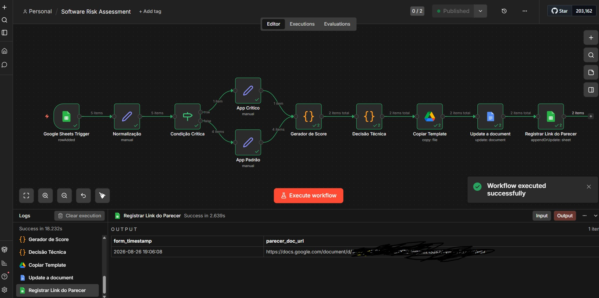

# n8n-secops-automation

Automação real (não um exercício hipotético) de homologação de risco de software: um Google Forms
que qualquer área da empresa usa pra pedir a adoção de um novo software vira, sem trabalho manual, um
parecer técnico completo, um por submissão. Construído sozinho por um analista de Segurança da
Informação, ainda em ambiente de desenvolvimento (a adoção oficial depende de infraestrutura que a
empresa ainda vai disponibilizar), projeto irmão do [`morpheus-beta`](https://github.com/domcabral9/morpheus-beta)
(mesmo problema de risco-homologação, stack e contexto completamente diferentes: aqui é n8n Community +
Google Workspace sobre um processo corporativo já em uso, lá é uma plataforma full-stack construída do
zero como projeto educacional).

## O que o projeto faz

1. Recebe a submissão de um formulário real de homologação (27 perguntas: identificação do software,
   licenciamento, responsabilidade, infraestrutura, controle de acesso, integrações, tratamento de
   dados).
2. Normaliza cada resposta pelo **ID interno da pergunta**, não pelo texto - sobrevive a uma pergunta
   ser reescrita, e detecta sozinho quando o mapeamento fica desatualizado (`mapping_status`) em vez de
   quebrar silenciosamente.
3. Calcula um score de risco (0-5) numa matriz **Probabilidade x Impacto**, com peso e dimensão
   configurados por critério de segurança.
4. Gera um parecer técnico completo - inclusive as observações são calculadas a partir da contribuição
   real de cada critério pra aquela submissão específica, não texto fixo repetido em todo parecer - num
   Google Doc novo por submissão, copiado de um template, com o link registrado de volta na planilha.

## O problema que resolve

A versão anterior deste processo dependia de alguém copiar e colar manualmente as respostas do
formulário pra uma aba com nomes de coluna padronizados, toda vez que alguém editava uma pergunta do
Forms - porque o Google Forms reescreve o cabeçalho da aba de respostas com o texto completo da
pergunta a cada edição, desfazendo esse trabalho manual sem avisar ninguém. O motor de risco continuava
rodando normalmente, só que contra dados vazios, produzindo um parecer errado de forma silenciosa.

A correção não foi só automatizar esse copy-paste: foi eliminar a dependência do texto da pergunta por
completo, lendo pelo ID interno de cada item do formulário (estável mesmo se a pergunta for reescrita),
com um mecanismo que detecta e sinaliza qualquer desvio de mapeamento na primeira submissão seguinte -
ver [`docs/architecture.md`](./docs/architecture.md) pro raciocínio completo.

## Metodologia do motor de risco

Mesma abordagem clássica de avaliação de risco usada no [`morpheus-beta`](https://github.com/domcabral9/morpheus-beta)
- probabilidade x impacto, alinhada com frameworks como o NIST SP 800-30: cada critério de segurança
(MFA, SSO, exposição à internet, controle de acesso, auditoria, criticidade do negócio, dados pessoais)
contribui, com peso próprio, pra uma das duas dimensões - **Probabilidade** (o quanto ele afeta a chance
de um incidente acontecer) ou **Impacto** (o quanto ele afeta a gravidade se acontecer) - e o resultado
final é classificado contra faixas de decisão (Homologado / Homologado com Ressalvas / Não Homologado).

Isso resolve um caso de borda real encontrado na validação: sem separar as duas dimensões, um software
crítico e exposto à internet, mas com todos os controles de segurança presentes, podia sair classificado
como risco baixo sem nenhuma ressalva - a única média ponderada permitia que bons controles "compensassem"
uma criticidade/exposição alta demais. Com a separação, o mesmo perfil corretamente sai como Homologado
com Ressalvas.

**Isenção pra software standalone**: MFA, SSO, RBAC e logs de auditoria não fazem sentido pra um
software autônomo sem contas de usuário (um leitor de PDF, um utilitário local) - o modelo original
penalizava a ausência desses controles como risco máximo, mesmo quando a pergunta simplesmente não se
aplicava. A correção suspende a penalidade só quando a hospedagem é "Standalone" **e** a resposta é
"Não"/"Não sei informar" - um software autônomo que realmente tem um desses controles (um gerenciador
de senhas local com MFA próprio, por exemplo) continua recebendo o crédito normalmente.

## Evidência real

| Canvas do workflow (execução bem-sucedida) |
| --- |
|  |

Parecer gerado por uma submissão de teste real (nome fictício, dado de contato genérico de propósito -
ver [`docs/demo-data-checklist.md`](./docs/demo-data-checklist.md)):

```
PARECER TÉCNICO DE AVALIAÇÃO DE SOFTWARE

Aplicação: Higgsfield AI
Criticidade: Média
Modelo de hospedagem: SaaS

Score final (0-5, maior = mais seguro): 3.35
Classificação: Homologado com Ressalvas

Probabilidade de ocorrência: Média (2.22)
Impacto potencial: Baixo (4.27)

Principais fatores desta avaliação:
Aplicação exposta à internet, aumentando a superfície de ataque. Ausência de autenticação
centralizada (SSO).

Pontos positivos:
- Aplicação utiliza autenticação multifator (MFA).
- Aplicação possui controle de acesso baseado em papéis (RBAC).
- Aplicação mantém trilhas de auditoria (logging).
- Não há indicação de tratamento de dados pessoais.

Pontos de atenção:
- Aplicação exposta à internet, aumentando a superfície de ataque.
- Ausência de autenticação centralizada (SSO).

Recomendação:
A aplicação pode ser homologada mediante avaliação complementar e aceite dos riscos identificados.
```

O parecer completo (gerado no Google Doc real) inclui também uma seção com todas as 27 respostas do
formulário agrupadas por categoria - não só o subconjunto usado no cálculo de risco acima.

Segundo exemplo real, mostrando a isenção de software standalone em ação (submissão real, disparada
automaticamente pelo formulário, sem nenhum clique manual):

```
PARECER TÉCNICO DE AVALIAÇÃO DE SOFTWARE

Aplicação: 7-Zip
Criticidade: Baixa
Modelo de hospedagem: Standalone (instalação local, sem login)

Score final (0-5, maior = mais seguro): 5
Classificação: Homologado

Probabilidade de ocorrência: Baixa (5)
Impacto potencial: Baixo (5)

Principais fatores desta avaliação:
Nenhum fator de risco relevante identificado nos critérios avaliados.

Pontos positivos:
- Aplicação sem exposição direta à internet.
- Não há indicação de tratamento de dados pessoais.

Critérios não aplicáveis a este software:
- Autenticação multifator (MFA) não avaliada - software standalone sem superfície de autenticação.
- Autenticação centralizada (SSO) não avaliada - software standalone sem superfície de autenticação.
- Controle de acesso baseado em papéis (RBAC) não avaliado - software standalone sem contas de usuário.
- Trilhas de auditoria (logging) não avaliadas - software standalone sem contas de usuário.

Recomendação:
A aplicação atende aos critérios mínimos de segurança e pode ser homologada para uso.
```

## Arquitetura

Diagrama completo do pipeline (formulário → normalização → score → parecer) em
[`docs/architecture.md`](./docs/architecture.md). Documentação de cada script/node em
[`docs/nodes.md`](./docs/nodes.md).

## Stack

n8n Community Edition (self-hosted, Docker), Google Forms/Sheets/Docs/Drive, Google Apps Script.
Detalhes completos, estrutura do repositório e como acessar o ambiente em
[`docs/DEVELOPMENT.md`](./docs/DEVELOPMENT.md).

## Estrutura do repositório

```
n8n-secops-automation/
├── apps-script/     # normalização por ID de pergunta, bound ao Form
├── nodes/           # Code nodes do n8n (motor de score, geração de parecer)
├── workflows/       # workflow completo, exportado da instância real
└── docs/
```

## Status

Lógica core (normalização, score, parecer) reescrita e validada de ponta a ponta contra o formulário
real, incluindo o caminho totalmente automático (submissão real → parecer gerado, sem clique manual).
Ambiente ainda é uma VM de desenvolvimento local - próximo marco de infraestrutura depende da empresa
disponibilizar um ambiente de homologação na nuvem corporativa.

## Contato

[domcabral@proton.me](mailto:domcabral@proton.me)
