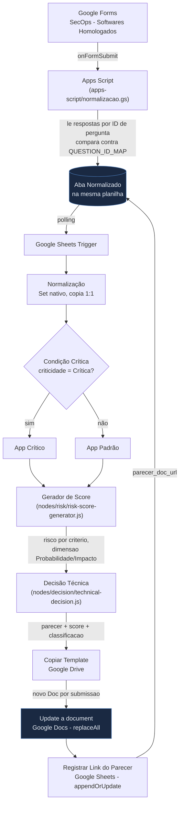

# Arquitetura

Sem banco de dados relacional pra desenhar (diferente do [`morpheus-beta`](https://github.com/domcabral9/morpheus-beta),
que tem um diagrama de modelo de dados), o equivalente aqui é o fluxo completo do pipeline: da
submissão do formulário até o parecer técnico gerado.

## Fluxo de ponta a ponta

## Por que a normalização vive fora do n8n

A causa raiz do problema original deste projeto (ver histórico de commits e `README.md`) era um
processo manual: alguém copiava e colava as respostas do formulário pra uma aba com nomes de coluna
padronizados toda vez que o formulário mudava. Toda edição de pergunta no Google Forms reescreve o
cabeçalho da aba original com o texto completo da pergunta, desfazendo esse paste manual sem avisar
ninguém - a automação continuava rodando, só que com valores-padrão, gerando um parecer errado
silenciosamente.

A correção não foi só automatizar esse copy-paste dentro do n8n: foi mover a normalização pra uma
camada que lê pelo **ID interno de cada pergunta** (`item.getId()` no Apps Script), que sobrevive a uma
pergunta ser reescrita e só quebra se ela for de fato apagada e recriada - e mesmo nesse caso, o próprio
Apps Script detecta o desvio (`mapping_status`) em vez de falhar silenciosamente. Ver
[`docs/DEVELOPMENT.md`](./DEVELOPMENT.md#manutenção-do-formulário-runbook) pro runbook de manutenção
quando isso acontece.

## Por que um Doc novo por submissão, não um Doc fixo atualizado

O desenho original apontava sempre pro mesmo Google Doc - cada nova homologação sobrescrevia o parecer
da anterior. O desenho atual copia o template (`Copiar Template`) antes de preencher, gerando um
arquivo novo e rastreável por submissão, com o link registrado de volta na aba `Normalizado`
(`parecer_doc_url`) - existe um índice de "qual parecer corresponde a qual submissão" sem precisar abrir
pasta por pasta no Drive.

## Motor de score: Probabilidade x Impacto

O cálculo de risco dentro de `Gerador de Score` segue o mesmo padrão do motor de risco do
[`morpheus-beta`](https://github.com/domcabral9/morpheus-beta) (`risk-engine.service.ts`): cada
critério tem peso (importância) e dimensão (`PROBABILITY` ou `IMPACT`), o motor calcula uma média
ponderada de risco por dimensão e inverte pra um score de segurança (0-5, maior = mais seguro). Ver
[`docs/nodes.md`](./nodes.md) pro detalhamento de cada critério.
